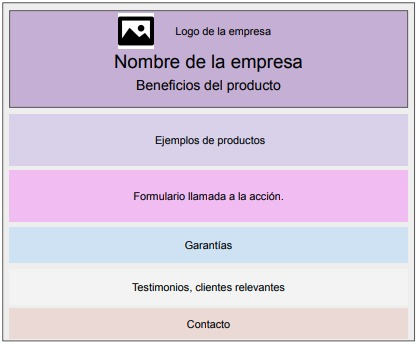
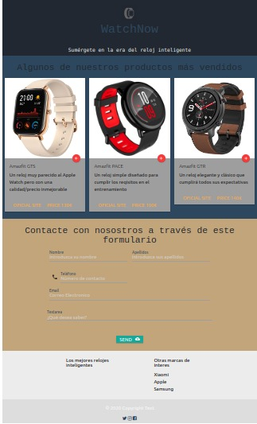

# Practica2 SASS

## Alberto Martín Núñez

### Objetivo de la práctica

El objetivo de esta práctica es crear un Mockup como el siguiente usando **SASS** y añadiendo algunos componentes y estilos con **Materialize**:





Como puntos a tratar importantes de esta practica podemos destacar el uso de variables mediante el archivo de *_variables.scss*, el uso de _mixins.scc* para definir estilos que se pueden reutilizar en culaquier parte y *_main*(aqui se importan los otros ficheros) este fichero es que se transpilará mediante *gulp* y se almacenará en */css/main.css*.


#### Se han añadido una serie de mixins en donde los encabezados h1 y h2 tienen el mismo estilo salvo el color que se modifica haciendo el codigo de la siguiente foma:

```scss
@mixin title($color, $size) {
    
    color: $color !important;
    font-family: $title_font !important;
    font-size: $size !important;
}

```

De esta forma llamamos a los *mixins*:

```scss
h1{

    @include title(#30475e, 60px);
    position: relative;
    margin-top: -20px;

}

h2{

    @include title(nth($colors, 1), 45px); 
    
}
```

#### También se nos pide que para centrar el contenido creemos otro mixin:

```scss
@mixin position_center($position) {

    display: flex;
    align-items: center;
    justify-content: center;
    flex-direction: $position;
}
```

#### Para la parte del formulario nos hemos ayudado de Materialize y he incorporado algunas clases que nos trae estas plantillas. Aun así se ha creado un mixin para modificar las etiquetas(label) de los campos y asi cambiar el color y su tamaño, ya que el que traia por defecto no era muy visible:

```scss
@mixin label-style {
    
    font-size: 20px !important;
    color: nth($colors, 2) !important;
    
}

```

#### Para añadir algun efecto cuando se aplique *hover* hemos hecho lo siguiente:

Por un lado he creado las *cards* para representar algunos productos y en ellos hay un boton en rojo que si pulsamos obtendríamos mas informacion del producto. Ese boton se ha añadido un efecto que actua sobre todos esos botones y cambia a verde cuando el usuario pasa por encima el ratón.

```scss
.icon-plus:hover{

    background-color: green;
}

```

#### Sobre los elementos de Materialize añadidos podemos destacar:

    - Las cards para mostrar los productos
    - El formulario(clases) para enriquecer el mockup
    - Boton de envio del formulario


Después de finalizar la práctica asi quedaría el mockup:

